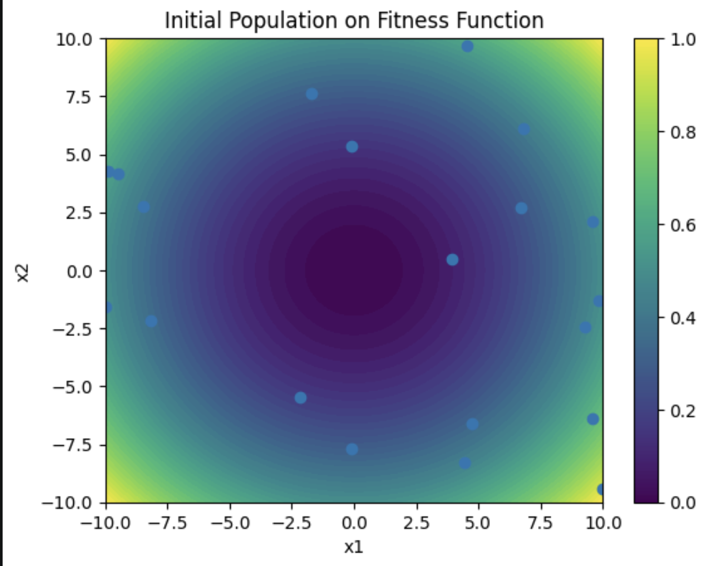
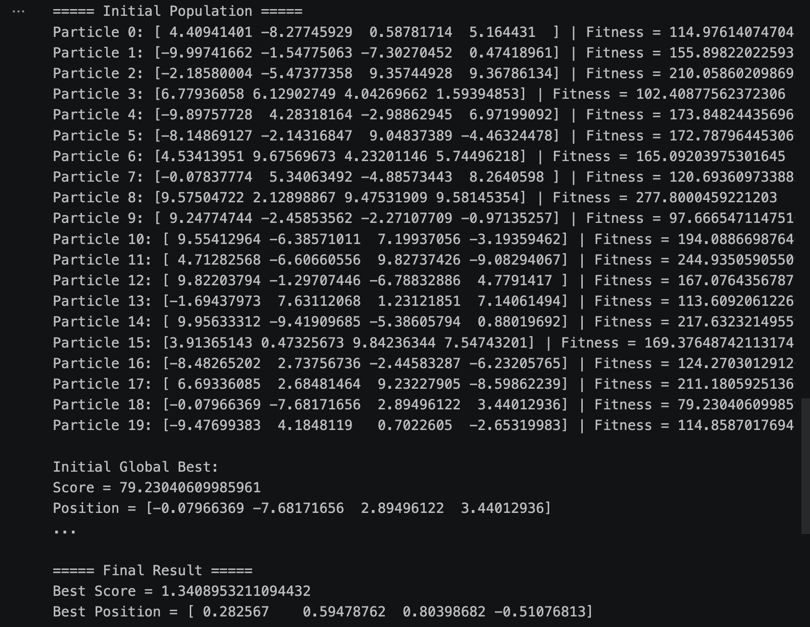

# Swarm Intelligence - Traveling Salesperson Problem (TSP) using ACO

This repository contains a Python implementation of the **Ant Colony Optimization (ACO)** algorithm to solve the classic **Traveling Salesperson Problem (TSP)**. 

The project is developed as part of the **Swarm Intelligence (Term 6)** course.

---

##  Project Overview

The Traveling Salesperson Problem (TSP) is an NP-hard problem in combinatorial optimization. This project uses the behaviors of artificial ants—specifically their pheromone trail-laying and following behavior—to find the shortest possible route that visits a set of random cities exactly once and returns to the origin city.

### Key Features:
* **Dynamic Probability Function:** Ants choose their next step based on both pheromone intensity ($\alpha$) and heuristic visibility/distance ($\beta$).
* **Pheromone Evaporation:** Simulates real-world evaporation using a decay rate ($\rho$) to avoid getting stuck in local optima.
* **Interactive Visualization:** Generates a 2D plot showing the optimized path linking all cities.

---

## ⚙️ Hyperparameters

The behavior of the ACO algorithm is highly dependent on the following parameters configured in the script:

| Parameter | Value | Description |
|---|---|---|
| `NUM_CITIES` | 20 | Number of cities to visit |
| `NUM_ANTS` | 20 | Number of ants deployed per iteration |
| `ITERATIONS` | 100 | Number of training iterations |
| `ALPHA` ($\alpha$) | 1.0 | Pheromone importance |
| `BETA` ($\beta$) | 5.0 | Heuristic/Distance importance (visibility) |
| `RHO` ($\rho$) | 0.5 | Pheromone evaporation/decay rate |
| `Q` | 100.0 | Pheromone deposit intensity factor |

---

